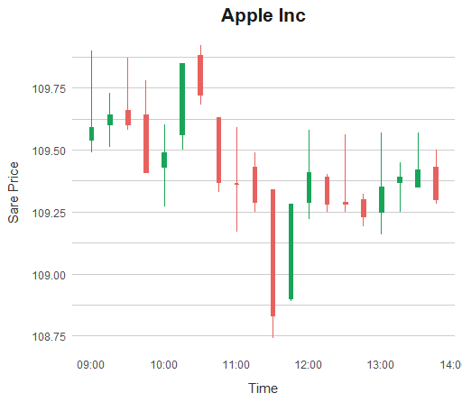

<!-- README.md is generated from README.Rmd. Please edit that file -->

```{r, include = FALSE}
knitr::opts_chunk$set(
  collapse = TRUE,
  comment = "#>",
  fig.path = "man/figures/README-",
  out.width = "100%"
)
```

# polygon

<div align="center">
<!-- hex -->
<!--  -->

<!-- badges: start -->
<!-- Experimental -->
[](https://www.tidyverse.org/lifecycle/#experimental) [](https://travis-ci.org/eokodie/polygon) 

<!-- [](https://codecov.io/gh/eokodie/polygon?branch=main) -->
<!-- badges: end -->

<!-- links start -->
<!-- links end -->

</div>


> A Websocket & RESTful API client for [Polygon](https://polygon.io).

This package is under active development. The API is likely to change and some features are incomplete.

## Installation

**polygon** is not yet on CRAN. You can install from GitHub with:
```{r, eval=FALSE}
# install.packages("remotes")
remotes::install_github("eokodie/polygon", ref = "main")
```

## Exampes

We can download quotes data from the REST API with:
```{r, eval=FALSE}
df <- polygon::get_aggregates(
  token,
  ticker = "AAPL",
  multiplier = 15,
  timespan = "minute",
  from = "2020-11-03",
  to = "2020-11-03"
) %>%
  head(20)

# # A tibble: 20 x 7
#    volume  open close  high   low time                items_in_agg_window
#     <dbl> <dbl> <dbl> <dbl> <dbl> <dttm>                            <int>
#  1  18425  110.  110.  110.  109. 2020-11-03 09:00:00                 233
#  2  12067  110.  110.  110.  110. 2020-11-03 09:15:00                 182
#  3  14066  110.  110.  110.  110. 2020-11-03 09:30:00                 191
#  4  12468  110.  109.  110.  109. 2020-11-03 09:45:00                 176
#  5   8804  109.  109.  110.  109. 2020-11-03 10:00:00                 128
#  6   7713  110.  110.  110.  110. 2020-11-03 10:15:00                 123
#  7  12345  110.  110.  110.  110. 2020-11-03 10:30:00                 147
#  8  10551  110.  109.  110.  109. 2020-11-03 10:45:00                 152
#  9  14786  109.  109.  110.  109. 2020-11-03 11:00:00                 169
# 10  18022  109.  109.  109.  109. 2020-11-03 11:15:00                 178
```

Which looks like this:
```{r, eval=FALSE}
# remotes::install_github("eokodie/fivethemes", ref = "main")
fivethemes:::plot_candlestick(df, title = "Apple Inc")
```

