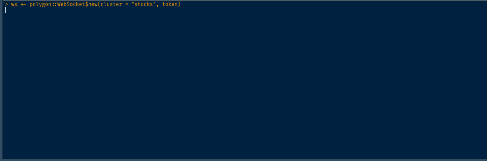

<!-- README.md is generated from README.Rmd. Please edit that file -->

# polygon

<div align="center">

<!-- hex -->
<!--  -->
<!-- badges: start -->
<!-- Experimental -->

[](https://www.tidyverse.org/lifecycle/#experimental)

<!-- [](https://travis-ci.org/eokodie/polygon)  -->
<!-- [](https://codecov.io/gh/eokodie/polygon?branch=main) -->
<!-- badges: end -->
<!-- links start -->
<!-- links end -->

</div>

> A WebSocket & RESTful API client for [polygon.io](https://polygon.io).

This package is under active development. The API is likely to change
and some features are incomplete.

## Installation

`polygon` is not yet on CRAN. You can install from GitHub with:

``` r
# install.packages("remotes")
remotes::install_github("eokodie/polygon", ref = "main")
```

## Authentication

By default, the `polygon` R package looks for API keys in environment
variables. You can also use this to specify your token. For example:

``` r
Sys.setenv(POLYGON_TOKEN = "my-polygon-token")
```

These can alternatively be set on the command line or via an
Renviron.site or .Renviron file.

e.g. In your .Renviron:

``` r
POLYGON_TOKEN = "my-polygon-token"
```

If you don’t have an API key already, you can obtain one from
[polygon.io](https://polygon.io).

## WebSocket

The WebSocket client is implemented with R6 classes to give a simplified
interface. For example, you can connect to Apple Inc’s real-time stock
trades stream with the following:

``` r
library(polygon)
ws <- polygon::WebSocket$new(cluster = "stocks")
ws$subscribe("T.AAPL")
ws$unsubscribe("T.AAPL")
ws$close()
```



The `polygon` package enables connection to 3 separate real-time
clusters. One for each market type:

| Cluster        | Websocket Implementation |
|:---------------|:------------------------:|
| Stocks cluster |   :heavy\_check\_mark:   |
| Forex Cluster  |   :heavy\_check\_mark:   |
| Crypto Cluster |   :heavy\_check\_mark:   |

## REST API

The REST client is implemented with a functional interface. Below are
some examples.

You can download Apple quotes data with:

``` r
data <- polygon::get_aggregates(
  ticker     = "AAPL",
  multiplier = 15,
  timespan   = "minute",
  from       = "2020-11-03",
  to         = "2020-11-03"
) 
df <- head(data, 20)
df
# # A tibble: 20 x 6
#    volume  open close  high   low time               
#     <dbl> <dbl> <dbl> <dbl> <dbl> <dttm>             
#  1  18873  113.  113.  113.  113. 2020-10-06 22:20:00
#  2  19200  113.  113.  113.  113. 2020-10-06 22:25:00
#  3  48628  113.  113.  113.  113. 2020-10-06 22:30:00
#  4  18053  113.  113.  113.  113. 2020-10-06 22:35:00
#  5  26782  113.  113.  113.  113. 2020-10-06 22:40:00
#  6  35494  113.  113.  113.  113. 2020-10-06 22:45:00
#  7  53465  113.  113.  113.  113. 2020-10-06 22:50:00
#  8  22497  113.  113.  113.  113. 2020-10-06 22:55:00
#  9  27947  113.  113.  113.  113. 2020-10-06 23:00:00
# 10  14125  113.  113.  113.  113. 2020-10-06 23:05:00
```

Which looks like this:

``` r
# remotes::install_github("eokodie/fivethemes", ref = "main")
fivethemes:::plot_candlestick(df, title = "Apple Inc.")
```


You can get the list of currently supported locales with:

``` r
get_locales()

# # A tibble: 19 x 2
#    locale name                    
#    <chr>  <chr>                   
#  1 G      Global                  
#  2 US     United States of America
#  3 GB     Great Britain           
#  4 CA     Canada                  
#  5 NL     Netherlands             
#  6 GR     Greece                  
#  7 SP     Spain                   
#  8 DE     Germany                 
#  9 BE     Belgium                 
# 10 DK     Denmark                 
# 11 FI     Finland                 
# 12 IE     Ireland                 
# 13 PT     Portugal                
# 14 IN     India                   
# 15 MX     Mexico                  
# 16 FR     France                  
# 17 CN     China                   
# 18 CH     Switzerland             
# 19 SE     Sweden 
```

Get a list of supported crypto currency exchanges with.

``` r
polygon::get_exchanges_cypto()
#> # A tibble: 22 x 5
#>       id type     market name     url                      
#>    <int> <chr>    <chr>  <chr>    <chr>                    
#>  1     1 exchange crypto GDAX     https://www.gdax.com/    
#>  2     2 exchange crypto BITFINEX https://www.bitfinex.com/
#>  3     3 exchange crypto BitMEX   https://www.bitmex.com/  
#>  4     4 exchange crypto Binance  https://www.binance.com/ 
#>  5     5 exchange crypto Binance  https://gemini.com/      
#>  6     6 exchange crypto Bitstamp https://www.bitstamp.net/
#>  7     7 exchange crypto POLONIEX https://poloniex.com/    
#>  8     8 exchange crypto CEXIO    https://cex.io/          
#>  9     9 exchange crypto BitBay   https://bitbay.net/en    
#> 10    10 exchange crypto HitBTC   https://hitbtc.com/      
#> # ... with 12 more rows
```

## Issues & Contributions

If you encounter a clear bug, please file an issue with a minimal
reproducible example on
[GitHub](https://github.com/eokodie/polygon/issues).

Contributions to the package are welcome. Please start by filing an
[issue](https://github.com/eokodie/polygon/issues), outlining the bug
you intend to fix or functionality you intend to add or modify.

## Code of Conduct

Please note that this project is released with a [Contributor Code of
Conduct](.github/CODE_OF_CONDUCT.md). By participating in this project
you agree to abide by its terms.
